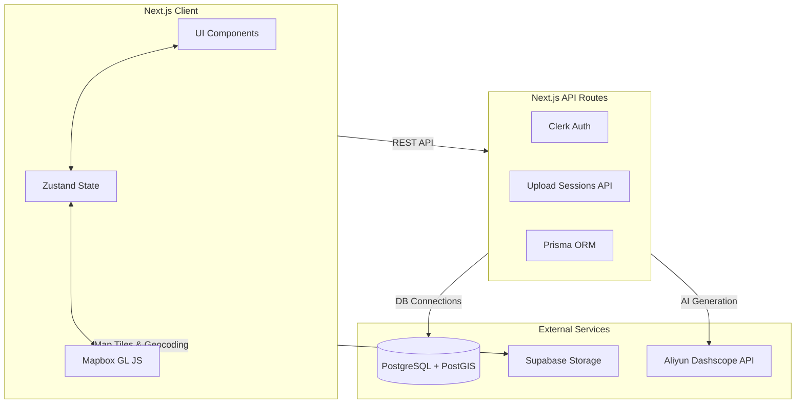

# 🌍 FootprintQ 

Welcome to **FootprintQ** (My 3D Footprint) — A stunning, interactive 3D footprint map application designed to visualize your travel journeys, automatically parse photo locations, and transform your memories into cinematic stories and beautiful annual reports.

> **👇 Live Interactive Map Demo (Story Mode & Explore Mode)**
> 
> *The following is an actual recording of the interactive 3D globe in action:*
> 
> 

## ✨ Features

- 🗺️ **Interactive 3D Globe & Maps**: Experience your travels on a fully interactive 3D globe powered by **Mapbox GL JS**. Toggle between customized map textures (Satellite, Carto basemaps) and smooth fly-to animations.
- 📸 **Smart Photo Parsing & Batch Upload**: Upload images via drag-and-drop to automatically extract EXIF GPS data and map your footprint.
- 📱 **Cross-Device Uploading via QR Code**: Easily scan a QR code on your PC screen to securely trigger uploads directly from your mobile device into your active session.
- 🤖 **AI-Powered Travel Diaries**: Integrated with **Dashscope (Qwen-VL-Max)** to automatically polish your photo notes and generate context-aware, poetic travel stories.
- 🎬 **Story & Explore Modes**: 
  - **Story Mode**: Sit back and watch a cinematic, auto-panning journey through your geographical footprint with custom camera movements.
  - **Explore Mode**: Focus on your map markers with an atmospheric desaturated basemap and glowing active state indicators.
- 📊 **Annual Reports & Travel Posters**: Generate dynamic, shareable travel posters and map snapshots summarizing your footprint stats (Memories, Cities, Countries crossed).
- 💎 **Modern UI & Responsive Design**: A beautiful, glassmorphism-inspired interface powered by **Tailwind CSS v4**. Works flawlessly across desktop and mobile, implementing silky-smooth bottom sheets (`vaul`) for touch interactions.
- 🌐 **Internationalization (i18n)**: Seamless language switching (English / 简体中文) via Next-intl.

## 🛠️ Tech Stack

- **Core Framework**: [Next.js 16](https://nextjs.org/) (App Router), React 19
- **Geomorphology & Mapping**: Mapbox GL JS, Turf.js
- **Styling**: [Tailwind CSS v4](https://tailwindcss.com/)
- **Database Architecture**: PostgreSQL + **PostGIS** for spatial queries
- **ORM**: [Prisma 5.22.0](https://www.prisma.io/)
- **Asset Storage**: [Supabase Storage](https://supabase.com/)
- **Authentication**: [Clerk](https://clerk.com/)
- **AI Capabilities**: Aliyun Dashscope API

## 🧩 Project Architecture

FootprintQ utilizes a modern, decoupled architecture to ensure smooth performance for rendering 3D maps and handling media uploads.

## 🌟 Showcase & Portfolio Use
This repository (**FootprintQ-showcase**) serves as a public demonstration of the architecture, tech stack, and visual capabilities of the FootprintQ application. 

> **Note on Source Code**: The core source code repository (`my-3d-footprint`) is currently maintained as **Private** to protect proprietary API integration logic and backend configurations. 

While the full source code is not publicly available for cloning, this showcase provides a comprehensive look into the design patterns, UI/UX implementation, and sophisticated mapping technologies employed in the project.

## 📁 Core Directory Structure

- `src/app/`: Next.js App Router pages (Landing, Login, APIs).
- `src/app/api/`: Backend REST routes covering upload sessions, geocoding reverse lookups, and AI proxying.
- `src/components/`: Modular UI building blocks. `MapboxView.tsx` serves as the heavy-lifting core for map initialization and state management.
- `src/lib/`: Core utilities including Prisma/Supabase clients and the advanced `story-engine/`.
- `public/geojson/`: Boundary data parsing for region mapping.
- `prisma/schema.prisma`: The central truth for our Database Models (`User`, `Journey`, `PhotoNode`, and `UploadSession`).

## 👨‍💻 Developer Notes
- **Styling Rules**: This project uses a CSS-first configuration via `globals.css` with Tailwind CSS v4. No legacy `tailwind.config.js` is utilized.
- **Geocoding Context**: We rely on Amap APIs for domestic (China) geocoding and standard Mapbox geocoding for international locations to handle boundary precision.

## 📜 License
*Project primarily for portfolio and showcase purposes.*